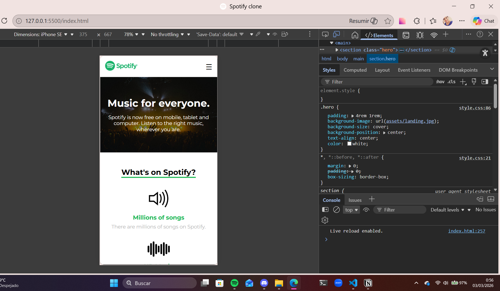
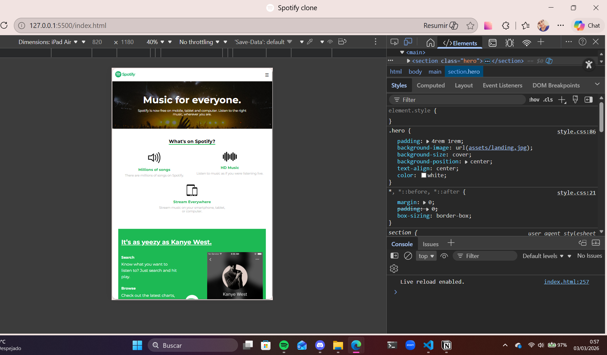
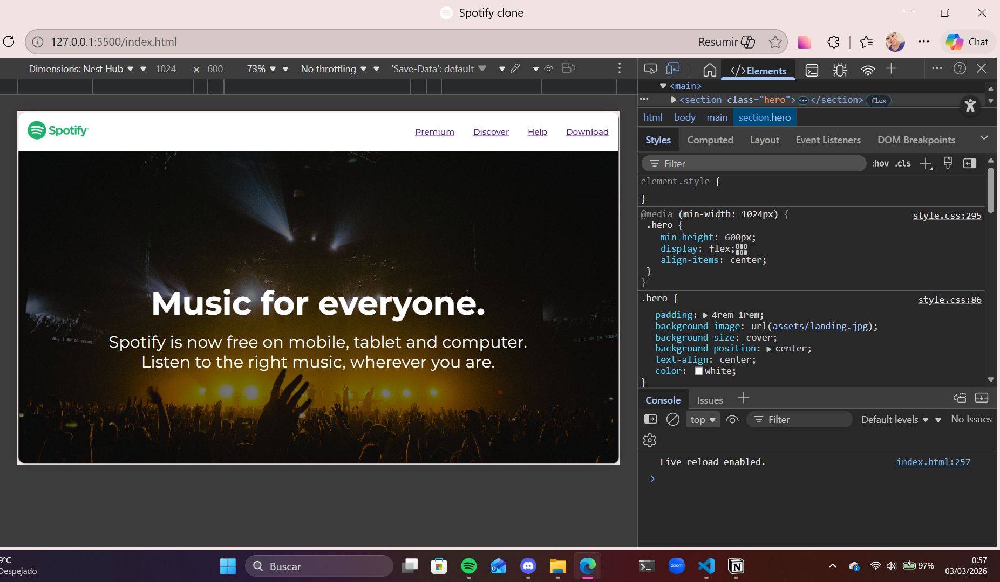

# 🚀 Mi Landing Page Responsiva

## 🎯 Descripción del proyecto
Esta es mi landing page responsive de una app ficticia. Tiene secciones de **hero**, **info destacada**, **promo** y **descarga de app**.  
Quise practicar **Flexbox**, **media queries** y hacer que todo se vea **bonito en móvil, tablet y desktop**. 😏  

---

## 🖼️ Capturas de pantalla

- **Móvil** 📱  

- **Tablet** 💻  

- **Desktop** 🖥️  

---

## 🛠️ Tecnologías utilizadas
  
  
- **CSS Variables** para colores, spacing y tipografía.  
- **Flexbox & Media Queries** para un layout que se adapta a todo.  
- **Clamp()** para que los textos escalen como se debe.

---

## 💡 Lo que construí
- Hero con imagen de fondo y texto centrado.  
- Info con **3 columnas en desktop**, **2 en tablet** y **1 en móvil**.  
- Promo con imagen y contenido alineados siempre, incluso en tablet.  
- Diseño limpio y responsive sin frameworks.  

---

## 📝 Lo que aprendí
- A **dominar Flexbox** y alinear columnas como un jefe.  
- A usar `flex: 0 0 32%` para que las columnas no se rompan en desktop.  
- Que el **orden de los media queries importa** más de lo que crees 😅  
- Cómo usar `clamp()` para textos que escalen bonito en todas las pantallas. 
- Que `scroll-behavior: smooth` hace que el scroll sea suave y elegante.

---

## ⚡ Lo que mejoraría con más tiempo
- Añadir **animaciones** tipo fade-in o slide-in al hacer scroll.  
- Mejorar la **accesibilidad** y contraste de colores.  
- Optimizar imágenes para que carguen rapidísimo.  
- Agregar **interactividad** con JS (carruseles, tabs o botones cool).  

---

## 🌐 URL del proyecto desplegado
[Ver proyecto online](https://github.com/ruddycruzc/clon-spotify.git) 🚀  

---

✨ ¡Y listo! Este README refleja mi personalidad: profesional pero con un toque divertido.  
